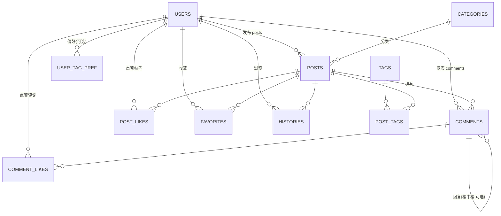

# 数据库设计（ER 图 + 建表说明）

> 本文档是**全队唯一权威的表结构约定**。任何人建表、写 SQL、写接口，都以这里为准。
> 改表结构必须先改文档并通知全队，不要各自私下加列。

## 一、ER 图（实体关系）

**关系图例**：`||--o{` = 左边一条，右边多条（一对多）。

## 二、核心表：用户与认证

### users — 用户表
| 字段 | 类型 | 约束 | 说明 |
|------|------|------|------|
| id | BIGINT | PK,自增 | |
| username | VARCHAR(50) | 唯一,非空 | 登录账号/学号 |
| password_hash | VARCHAR(255) | 非空 | 加密后的密码 |
| nickname | VARCHAR(50) | 可空 | 显示昵称 |
| avatar_url | VARCHAR(500) | 可空 | 头像链接 |
| email | VARCHAR(100) | 唯一,可空 | 邮箱 |
| bio | VARCHAR(255) | 可空 | 个人简介 |
| role | VARCHAR(20) | 默认 'user' | user / admin |
| status | SMALLINT | 默认 1 | 1=正常 0=封禁 |
| created_at | TIMESTAMPTZ | 默认 now() | |
| updated_at | TIMESTAMPTZ | 默认 now() | |

## 三、帖子核心

### categories — 帖子分类（板块）
| 字段 | 类型 | 约束 | 说明 |
|------|------|------|------|
| id | BIGINT | PK,自增 | |
| name | VARCHAR(50) | 唯一,非空 | 分类名 |
| description | VARCHAR(200) | 可空 | 说明 |
| sort_order | INT | 默认 0 | 排序 |
| created_at | TIMESTAMPTZ | 默认 now() | |
| updated_at | TIMESTAMPTZ | 默认 now() | |

> 分类种子数据（5 个）：随便聊聊 / 校园生活 / 学习交流 / 二手交易 / 社团活动。

### posts — 帖子表
| 字段 | 类型 | 约束 | 说明 |
|------|------|------|------|
| id | BIGINT | PK,自增 | |
| user_id | BIGINT | FK→users,非空 | 作者 |
| category_id | BIGINT | FK→categories,可空 | 分类 |
| title | VARCHAR(200) | 非空 | 标题 |
| content | TEXT | 非空 | 正文 |
| view_count | INT | 默认 0 | 浏览数(冗余) |
| like_count | INT | 默认 0 | 点赞数(冗余) |
| favorite_count | INT | 默认 0 | 收藏数(冗余) |
| comment_count | INT | 默认 0 | 评论数(冗余) |
| is_pinned | BOOLEAN | 默认 false | 置顶 |
| is_deleted | BOOLEAN | 默认 false | 软删除 |
| status | SMALLINT | 默认 1 | 1=正常(默认) 0=隐藏 2=官方推荐(预留) |
| created_at | TIMESTAMPTZ | 默认 now() | |
| updated_at | TIMESTAMPTZ | 默认 now() | |

### tags — 标签表（推荐算法基础）
| 字段 | 类型 | 约束 | 说明 |
|------|------|------|------|
| id | BIGINT | PK,自增 | |
| name | VARCHAR(50) | 唯一,非空 | 标签名 |
| created_at | TIMESTAMPTZ | 默认 now() | |
| updated_at | TIMESTAMPTZ | 默认 now() | |

> 标签种子数据（10 个）：考研 / 自习室 / 课程 / 食堂 / 社团 / 二手 / 求助 / 组队 / 活动 / 经验分享。

### post_tags — 帖子与标签（多对多）
| 字段 | 类型 | 约束 | 说明 |
|------|------|------|------|
| post_id | BIGINT | FK→posts,ON DELETE CASCADE | |
| tag_id | BIGINT | FK→tags,ON DELETE CASCADE | |
| （联合主键 post_id + tag_id） | | | |

## 四、互动系统

### comments — 评论表
| 字段 | 类型 | 约束 | 说明 |
|------|------|------|------|
| id | BIGINT | PK,自增 | |
| post_id | BIGINT | FK→posts,非空 | 所属帖子 |
| user_id | BIGINT | FK→users,非空 | 评论者 |
| parent_id | BIGINT | FK→comments,可空 | 回复哪条(楼中楼) |
| content | TEXT | 非空 | 内容 |
| like_count | INT | 默认 0 | 评论点赞数（点赞记录见 comment_likes） |
| status | SMALLINT | 默认 1 | 1=正常 0=删除 |
| created_at | TIMESTAMPTZ | 默认 now() | |
| updated_at | TIMESTAMPTZ | 默认 now() | |

### post_likes — 点赞表
| 字段 | 类型 | 约束 | 说明 |
|------|------|------|------|
| id | BIGINT | PK,自增 | |
| user_id | BIGINT | FK→users,非空 | |
| post_id | BIGINT | FK→posts,非空 | |
| created_at | TIMESTAMPTZ | 默认 now() | |
| （唯一约束 user_id + post_id，防止重复点赞） | | | |

### comment_likes — 评论点赞表
| 字段 | 类型 | 约束 | 说明 |
|------|------|------|------|
| id | BIGINT | PK,自增 | |
| user_id | BIGINT | FK→users,非空 | 点赞者 |
| comment_id | BIGINT | FK→comments,非空 | 被点赞的评论 |
| created_at | TIMESTAMPTZ | 默认 now() | |
| （唯一约束 user_id + comment_id，防止重复点赞） | | | |

### favorites — 收藏表
| 字段 | 类型 | 约束 | 说明 |
|------|------|------|------|
| id | BIGINT | PK,自增 | |
| user_id | BIGINT | FK→users,非空 | |
| post_id | BIGINT | FK→posts,非空 | |
| created_at | TIMESTAMPTZ | 默认 now() | |
| （唯一约束 user_id + post_id，防止重复收藏） | | | |

## 五、记录中心

### histories — 浏览记录
| 字段 | 类型 | 约束 | 说明 |
|------|------|------|------|
| id | BIGINT | PK,自增 | |
| user_id | BIGINT | FK→users,非空 | |
| post_id | BIGINT | FK→posts,非空 | |
| viewed_at | TIMESTAMPTZ | 默认 now() | |
| created_at | TIMESTAMPTZ | 默认 now() | |
| updated_at | TIMESTAMPTZ | 默认 now() | |
| （唯一约束 user_id + post_id，同一帖子只留一条，重复浏览刷时间） | | | |

## 六、推荐算法（可选，二期）

### user_tag_preferences — 用户偏好标签
> 可先不建表，用"行为聚合查询"实时算。要缓存、留记录时再建表。
| 字段 | 类型 | 约束 | 说明 |
|------|------|------|------|
| user_id | BIGINT | FK→users,非空 | |
| tag_id | BIGINT | FK→tags,非空 | |
| weight | INT | 默认 0 | 偏好权重（点赞/收藏/浏览累计） |
| updated_at | TIMESTAMPTZ | 默认 now() | |
| （联合主键 user_id + tag_id） | | | |

## 七、业务规则（重要，全队看）

1. **计数用冗余字段**：`posts` 里的 `*_count` 在点赞/收藏/评论/浏览**同一个事务里**更新，别每次都 `COUNT()`，会慢。
2. **帖子用软删除**：删除帖子只是 `is_deleted = true`，不真删，保证历史/收藏/评论仍可查。
3. **唯一约束防重复**：点赞、收藏靠 `UNIQUE` 拦重复；浏览记录靠 `UNIQUE(user_id, post_id)` 让同一帖子只留一条。
4. **外键删帖级联**：删帖子时其点赞/收藏/评论/标签关联一起清（`ON DELETE CASCADE`）。
5. **时间统一用 TIMESTAMPTZ**，存 `now()`，前端再按需格式化。
6. **可执行脚本**：`docs/campushub_schema.sql` 是这套结构的可直接执行版本（含索引、CHECK 约束、种子数据），文档与脚本必须保持一致。
